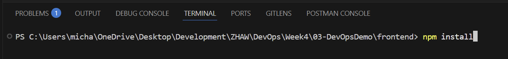
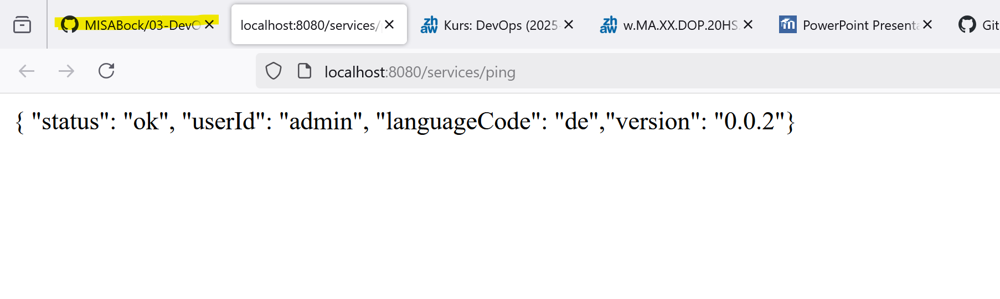
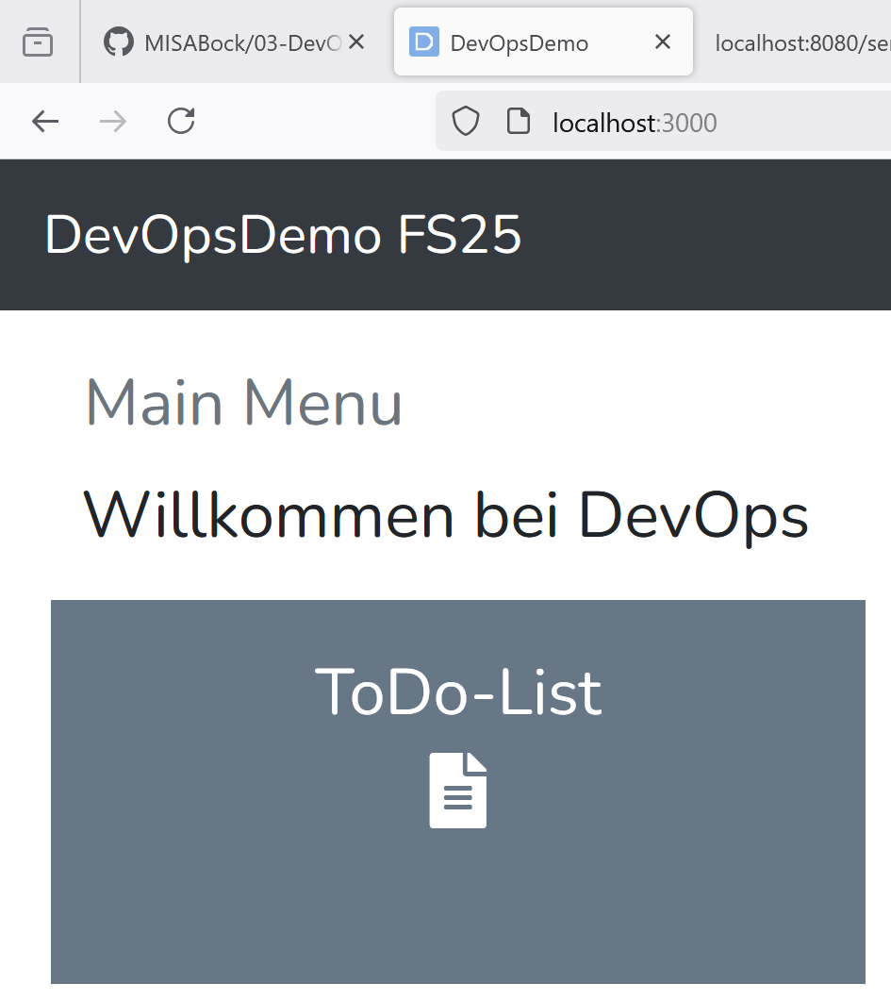
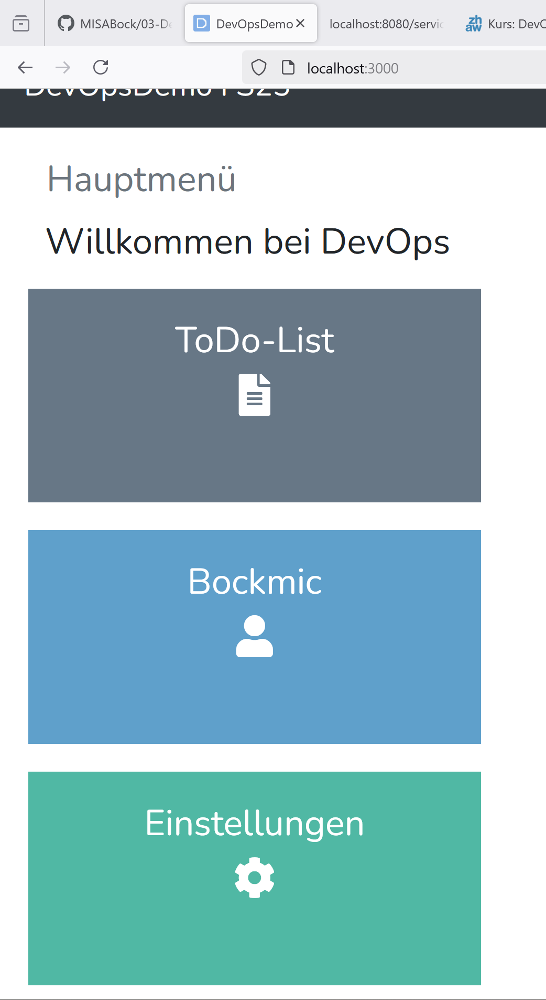
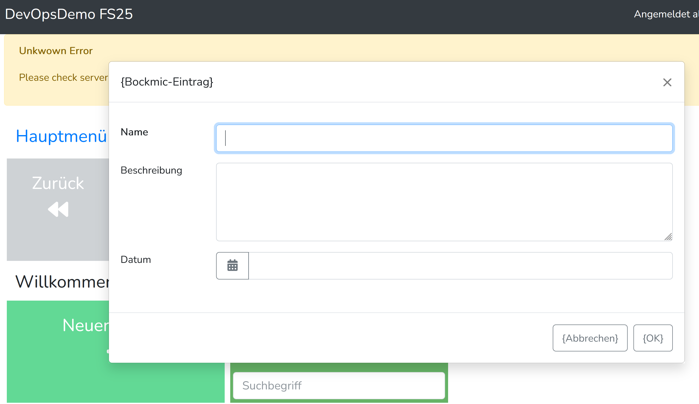

# DevOps 03 DevOpsDemo

## Lernjournal

als erstes habe ich das Template von - https://github.com/devopszhaw/DevOps-03-DevOpsDemo ausgewählt und dann ein eigenes Repo instanziert und dieses auf meinen Rechner mit git clone geholt.

als zweites habe ich die Workspace definition geöffnet.

um npm installieren zu können, habe ich vorher noch die working directory auf frontend gewechselt: ()

Nach dem npm erfolgreich installiert wurde, habe ich die Applikation gestartet und im localhost8080 nachgeschaut ob das Backend reibungslos funktioniert: ()

mit npm run start habe ich dann auch noch das frontend gestartet und getestet: ()

# GUI-Model anpassen

Ich habe der Main Page zwei weitere Kacheln hinzugefügt. die Kachel Bockmic1 und Einstellungen. ()

desweiteren habe ich für beide Kacheln eigene Seiten erstellen lassen. Siehe Bockmic Seite. ()

als letztes habe ich auf der Bockmic-Seite eine Form erstellt. ()